## Что входит в работу


1. Загрузить данные и провести разведочный анализ.
2. Предположить оптимальное количество кластеров.
3. Очистить и подготовить данные для использования в моделях машинного обучения.
4. Построить модель кластеризации с помощью библиотеки Scikit-learn и вычислить оптимальное количество кластеров.
5. Визуализировать результаты кластеризации.
6. Интерпретировать полученные результаты.
7. Подкрепить выводы интерпретации визуализациями.

# Задача

Имеется набор данных `marketing_campaign.csv` о покупателях супермаркета.

* ID: уникальный идентификатор клиента.
* Year_Birth: год рождения клиента.
* Dt_Customer: дата регистрации клиента на сайте.
* Recency: количество дней с момента последней покупки клиента.
* Complain: 1, если клиент жаловался на обслуживание за последние два года, 0 в противном случае.
* MntFruits: сумма, потраченная на фрукты за последние два года.
* MntMeatProducts: сумма, потраченная на мясо за последние два года.
* MntFishProducts: сумма, потраченная на рыбу за последние два года.
* MntSweetProducts: сумма, потраченная на сладости за последние два года.
* Response: 1, если клиент участвовал в последней рекламной кампании, 0 в противном случае.
* NumWebPurchases: количество покупок, совершённых через сайт.
* NumStorePurchases: количество покупок, совершённых непосредственно в магазинах.

# Загрузка датасета, разведочный анализ данных


```python
import warnings

warnings.filterwarnings("ignore")
```


```python
import pandas as pd

df = pd.read_csv('marketing campaign.csv')

df.drop('ID', axis=1, inplace=True)

df.head()
```


<div>
<style scoped>
    .dataframe tbody tr th:only-of-type {
        vertical-align: middle;
    }

    .dataframe tbody tr th {
        vertical-align: top;
    }

    .dataframe thead th {
        text-align: right;
    }
</style>
<table border="1" class="dataframe">
  <thead>
    <tr style="text-align: right;">
      <th></th>
      <th>Year_Birth</th>
      <th>Dt_Customer</th>
      <th>Recency</th>
      <th>MntFruits</th>
      <th>MntMeatProducts</th>
      <th>MntFishProducts</th>
      <th>MntSweetProducts</th>
      <th>NumWebPurchases</th>
      <th>NumStorePurchases</th>
      <th>Response</th>
    </tr>
  </thead>
  <tbody>
    <tr>
      <th>0</th>
      <td>1957</td>
      <td>04-09-2012</td>
      <td>58</td>
      <td>88</td>
      <td>546</td>
      <td>172</td>
      <td>88</td>
      <td>8</td>
      <td>4</td>
      <td>1</td>
    </tr>
    <tr>
      <th>1</th>
      <td>1954</td>
      <td>08-03-2014</td>
      <td>38</td>
      <td>1</td>
      <td>6</td>
      <td>2</td>
      <td>1</td>
      <td>1</td>
      <td>2</td>
      <td>0</td>
    </tr>
    <tr>
      <th>2</th>
      <td>1965</td>
      <td>21-08-2013</td>
      <td>26</td>
      <td>49</td>
      <td>127</td>
      <td>111</td>
      <td>21</td>
      <td>8</td>
      <td>10</td>
      <td>0</td>
    </tr>
    <tr>
      <th>3</th>
      <td>1984</td>
      <td>10-02-2014</td>
      <td>26</td>
      <td>4</td>
      <td>20</td>
      <td>10</td>
      <td>3</td>
      <td>2</td>
      <td>4</td>
      <td>0</td>
    </tr>
    <tr>
      <th>4</th>
      <td>1981</td>
      <td>19-01-2014</td>
      <td>94</td>
      <td>43</td>
      <td>118</td>
      <td>46</td>
      <td>27</td>
      <td>5</td>
      <td>6</td>
      <td>0</td>
    </tr>
  </tbody>
</table>
</div>


```python
#Для начала сразу преобразую Dt_Customer в отдельние фичи  month, year, для дальнейших исследований
#Day не столь значителен
```


```python
df["Dt_Customer"] = pd.to_datetime(df["Dt_Customer"], format="%d-%m-%Y")

df["month"] = df["Dt_Customer"].dt.month
df["year"] = df["Dt_Customer"].dt.year

df.drop('Dt_Customer', axis=1, inplace=True)

df.head()
```


<div>
<style scoped>
    .dataframe tbody tr th:only-of-type {
        vertical-align: middle;
    }

    .dataframe tbody tr th {
        vertical-align: top;
    }

    .dataframe thead th {
        text-align: right;
    }
</style>
<table border="1" class="dataframe">
  <thead>
    <tr style="text-align: right;">
      <th></th>
      <th>Year_Birth</th>
      <th>Recency</th>
      <th>MntFruits</th>
      <th>MntMeatProducts</th>
      <th>MntFishProducts</th>
      <th>MntSweetProducts</th>
      <th>NumWebPurchases</th>
      <th>NumStorePurchases</th>
      <th>Response</th>
      <th>month</th>
      <th>year</th>
    </tr>
  </thead>
  <tbody>
    <tr>
      <th>0</th>
      <td>1957</td>
      <td>58</td>
      <td>88</td>
      <td>546</td>
      <td>172</td>
      <td>88</td>
      <td>8</td>
      <td>4</td>
      <td>1</td>
      <td>9</td>
      <td>2012</td>
    </tr>
    <tr>
      <th>1</th>
      <td>1954</td>
      <td>38</td>
      <td>1</td>
      <td>6</td>
      <td>2</td>
      <td>1</td>
      <td>1</td>
      <td>2</td>
      <td>0</td>
      <td>3</td>
      <td>2014</td>
    </tr>
    <tr>
      <th>2</th>
      <td>1965</td>
      <td>26</td>
      <td>49</td>
      <td>127</td>
      <td>111</td>
      <td>21</td>
      <td>8</td>
      <td>10</td>
      <td>0</td>
      <td>8</td>
      <td>2013</td>
    </tr>
    <tr>
      <th>3</th>
      <td>1984</td>
      <td>26</td>
      <td>4</td>
      <td>20</td>
      <td>10</td>
      <td>3</td>
      <td>2</td>
      <td>4</td>
      <td>0</td>
      <td>2</td>
      <td>2014</td>
    </tr>
    <tr>
      <th>4</th>
      <td>1981</td>
      <td>94</td>
      <td>43</td>
      <td>118</td>
      <td>46</td>
      <td>27</td>
      <td>5</td>
      <td>6</td>
      <td>0</td>
      <td>1</td>
      <td>2014</td>
    </tr>
  </tbody>
</table>
</div>


```python
df.describe().round(2)
```


<div>
<style scoped>
    .dataframe tbody tr th:only-of-type {
        vertical-align: middle;
    }

    .dataframe tbody tr th {
        vertical-align: top;
    }

    .dataframe thead th {
        text-align: right;
    }
</style>
<table border="1" class="dataframe">
  <thead>
    <tr style="text-align: right;">
      <th></th>
      <th>Year_Birth</th>
      <th>Recency</th>
      <th>MntFruits</th>
      <th>MntMeatProducts</th>
      <th>MntFishProducts</th>
      <th>MntSweetProducts</th>
      <th>NumWebPurchases</th>
      <th>NumStorePurchases</th>
      <th>Response</th>
      <th>month</th>
      <th>year</th>
    </tr>
  </thead>
  <tbody>
    <tr>
      <th>count</th>
      <td>2240.00</td>
      <td>2240.00</td>
      <td>2240.00</td>
      <td>2240.00</td>
      <td>2240.00</td>
      <td>2240.00</td>
      <td>2240.00</td>
      <td>2240.00</td>
      <td>2240.00</td>
      <td>2240.00</td>
      <td>2240.00</td>
    </tr>
    <tr>
      <th>mean</th>
      <td>1968.81</td>
      <td>49.11</td>
      <td>26.30</td>
      <td>166.95</td>
      <td>37.53</td>
      <td>27.06</td>
      <td>4.08</td>
      <td>5.79</td>
      <td>0.15</td>
      <td>6.47</td>
      <td>2013.03</td>
    </tr>
    <tr>
      <th>std</th>
      <td>11.98</td>
      <td>28.96</td>
      <td>39.77</td>
      <td>225.72</td>
      <td>54.63</td>
      <td>41.28</td>
      <td>2.78</td>
      <td>3.25</td>
      <td>0.36</td>
      <td>3.49</td>
      <td>0.68</td>
    </tr>
    <tr>
      <th>min</th>
      <td>1893.00</td>
      <td>0.00</td>
      <td>0.00</td>
      <td>0.00</td>
      <td>0.00</td>
      <td>0.00</td>
      <td>0.00</td>
      <td>0.00</td>
      <td>0.00</td>
      <td>1.00</td>
      <td>2012.00</td>
    </tr>
    <tr>
      <th>25%</th>
      <td>1959.00</td>
      <td>24.00</td>
      <td>1.00</td>
      <td>16.00</td>
      <td>3.00</td>
      <td>1.00</td>
      <td>2.00</td>
      <td>3.00</td>
      <td>0.00</td>
      <td>3.00</td>
      <td>2013.00</td>
    </tr>
    <tr>
      <th>50%</th>
      <td>1970.00</td>
      <td>49.00</td>
      <td>8.00</td>
      <td>67.00</td>
      <td>12.00</td>
      <td>8.00</td>
      <td>4.00</td>
      <td>5.00</td>
      <td>0.00</td>
      <td>6.00</td>
      <td>2013.00</td>
    </tr>
    <tr>
      <th>75%</th>
      <td>1977.00</td>
      <td>74.00</td>
      <td>33.00</td>
      <td>232.00</td>
      <td>50.00</td>
      <td>33.00</td>
      <td>6.00</td>
      <td>8.00</td>
      <td>0.00</td>
      <td>10.00</td>
      <td>2013.00</td>
    </tr>
    <tr>
      <th>max</th>
      <td>1996.00</td>
      <td>99.00</td>
      <td>199.00</td>
      <td>1725.00</td>
      <td>259.00</td>
      <td>263.00</td>
      <td>27.00</td>
      <td>13.00</td>
      <td>1.00</td>
      <td>12.00</td>
      <td>2014.00</td>
    </tr>
  </tbody>
</table>
</div>


```python
#Минимальный год рождения 1893 выглядит как выброс из-за опечатки при написании 1993
```


```python
df.Year_Birth.hist();
```


    
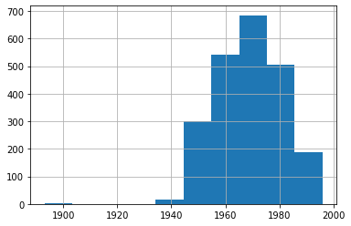
    


```python
df.Year_Birth = df.Year_Birth.apply(lambda x: x + 100 if x < 1930 else x)

#Прибавил 100 всем кто меньше 1930 года
```


```python
import seaborn as sns

sns.scatterplot(df.Year_Birth, df.year, hue=df.Response);
```


    
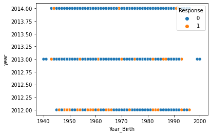
    


```python
#Видно что основная часть отозвавшихся на рекламу приходится на зарегистрировавшихся в 2012
#А так-же превалирует в части тех кто старше
```


```python
#Исследую зависимость между участием в последней акции и давностью посещения
```


```python
sns.histplot(data=df, x='Recency', hue='Response', multiple='stack', palette='Set2');
```


    
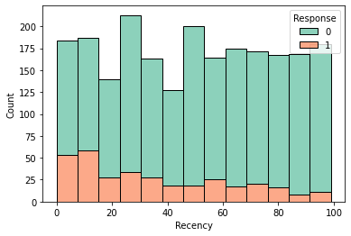
    


```python
#Чем недавнее человек посещал магазин, тем выше вероятность что он участвовал в акции
```

# Первое предположение

Клиентов можно делить по давности на 2 категории: давние лояльные и не столь давние "непрогретые". 

Их можно делить на пожилых и остальных, так как пожилые люди склонны к акциям больше.

А их можно делить на недавно активных и не посещавших наш магазин последнее время.

Итого 2x2x2 = 8 категорий

# Очистка и подготовка данных


```python
#Проверим выбросы

df.isna().sum()
```


    Year_Birth           0
    Recency              0
    MntFruits            0
    MntMeatProducts      0
    MntFishProducts      0
    MntSweetProducts     0
    NumWebPurchases      0
    NumStorePurchases    0
    Response             0
    month                0
    year                 0
    dtype: int64


```python
df.describe().round(2)
```


<div>
<style scoped>
    .dataframe tbody tr th:only-of-type {
        vertical-align: middle;
    }

    .dataframe tbody tr th {
        vertical-align: top;
    }

    .dataframe thead th {
        text-align: right;
    }
</style>
<table border="1" class="dataframe">
  <thead>
    <tr style="text-align: right;">
      <th></th>
      <th>Year_Birth</th>
      <th>Recency</th>
      <th>MntFruits</th>
      <th>MntMeatProducts</th>
      <th>MntFishProducts</th>
      <th>MntSweetProducts</th>
      <th>NumWebPurchases</th>
      <th>NumStorePurchases</th>
      <th>Response</th>
      <th>month</th>
      <th>year</th>
    </tr>
  </thead>
  <tbody>
    <tr>
      <th>count</th>
      <td>2240.00</td>
      <td>2240.00</td>
      <td>2240.00</td>
      <td>2240.00</td>
      <td>2240.00</td>
      <td>2240.00</td>
      <td>2240.00</td>
      <td>2240.00</td>
      <td>2240.00</td>
      <td>2240.00</td>
      <td>2240.00</td>
    </tr>
    <tr>
      <th>mean</th>
      <td>1968.94</td>
      <td>49.11</td>
      <td>26.30</td>
      <td>166.95</td>
      <td>37.53</td>
      <td>27.06</td>
      <td>4.08</td>
      <td>5.79</td>
      <td>0.15</td>
      <td>6.47</td>
      <td>2013.03</td>
    </tr>
    <tr>
      <th>std</th>
      <td>11.74</td>
      <td>28.96</td>
      <td>39.77</td>
      <td>225.72</td>
      <td>54.63</td>
      <td>41.28</td>
      <td>2.78</td>
      <td>3.25</td>
      <td>0.36</td>
      <td>3.49</td>
      <td>0.68</td>
    </tr>
    <tr>
      <th>min</th>
      <td>1940.00</td>
      <td>0.00</td>
      <td>0.00</td>
      <td>0.00</td>
      <td>0.00</td>
      <td>0.00</td>
      <td>0.00</td>
      <td>0.00</td>
      <td>0.00</td>
      <td>1.00</td>
      <td>2012.00</td>
    </tr>
    <tr>
      <th>25%</th>
      <td>1959.00</td>
      <td>24.00</td>
      <td>1.00</td>
      <td>16.00</td>
      <td>3.00</td>
      <td>1.00</td>
      <td>2.00</td>
      <td>3.00</td>
      <td>0.00</td>
      <td>3.00</td>
      <td>2013.00</td>
    </tr>
    <tr>
      <th>50%</th>
      <td>1970.00</td>
      <td>49.00</td>
      <td>8.00</td>
      <td>67.00</td>
      <td>12.00</td>
      <td>8.00</td>
      <td>4.00</td>
      <td>5.00</td>
      <td>0.00</td>
      <td>6.00</td>
      <td>2013.00</td>
    </tr>
    <tr>
      <th>75%</th>
      <td>1977.00</td>
      <td>74.00</td>
      <td>33.00</td>
      <td>232.00</td>
      <td>50.00</td>
      <td>33.00</td>
      <td>6.00</td>
      <td>8.00</td>
      <td>0.00</td>
      <td>10.00</td>
      <td>2013.00</td>
    </tr>
    <tr>
      <th>max</th>
      <td>2000.00</td>
      <td>99.00</td>
      <td>199.00</td>
      <td>1725.00</td>
      <td>259.00</td>
      <td>263.00</td>
      <td>27.00</td>
      <td>13.00</td>
      <td>1.00</td>
      <td>12.00</td>
      <td>2014.00</td>
    </tr>
  </tbody>
</table>
</div>


```python
#В describe были виден большой максимум в кол-ве интернет покупок, лучше проработать, тоже понадобится для анализа

plt.boxplot(df.NumWebPurchases);
```


    
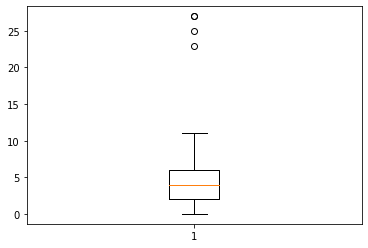
    


```python
df.NumWebPurchases = df.NumWebPurchases.apply(lambda x: x == df.NumWebPurchases.median() if x > 15 else x)
```


```python
#Заменил всё что больше 15 медианой

df.NumWebPurchases.hist();
```


    
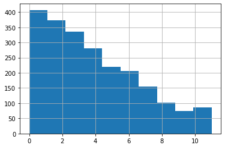
    


```python
#Выбросов нет
```


```python
#максимальные 1725 штук мяса видные в describe это мощно

df.MntMeatProducts.hist();
```


    
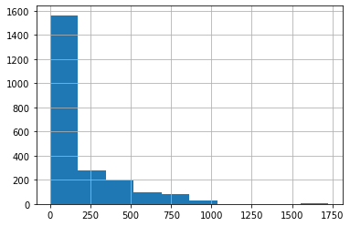
    


```python
#Ожидаемо, это выброс, тут не так понятно как он появился в отличии от возраста, поэтому заменю медианой
```


```python
df.MntMeatProducts = df.MntMeatProducts.apply(lambda x: x == df.MntMeatProducts.median() if x > 1100 else x)
```


```python
df.MntMeatProducts.hist();
```


    
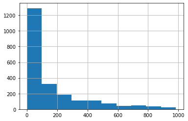
    


```python
#Построю график корреляций
```


```python
import matplotlib.pyplot as plt

fig, ax = plt.subplots(figsize=(10, 8), dpi=100)
sns.heatmap(df.corr(), annot=True, cmap='coolwarm', ax=ax, fmt='.2f');
```


    
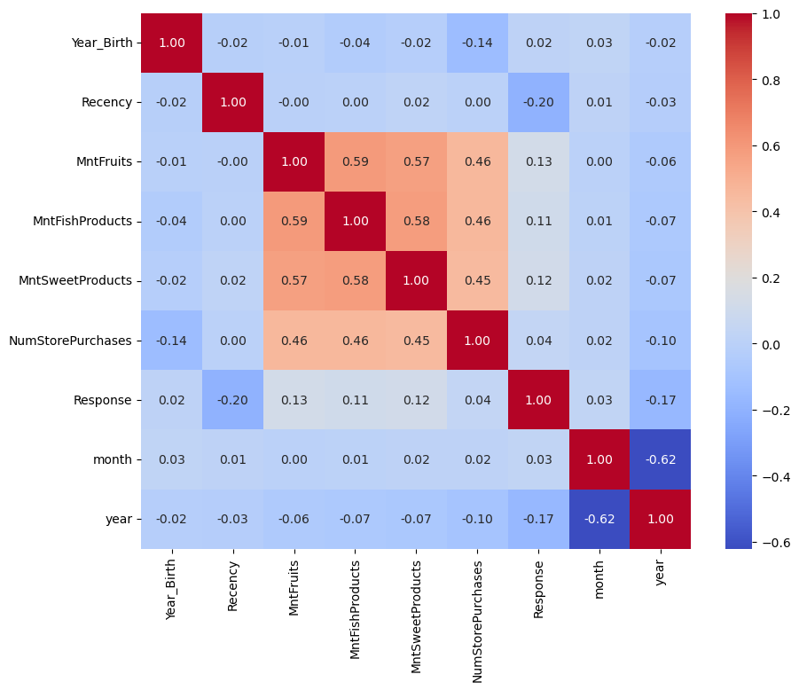
    


```python
#Корреляции в основном только среди кол-ва купленного типа товара, что закономерно.
#И участие в акциях у "больших" покупателей выше, тоже логично.
```


```python
plt.scatter(df.year, df.month);

#Вся корреляция между месяцем и годом заключается лишь в том, с какого месяца начались регистрации и до какого месяца данные.

#В другом месяц не коррелирует ни с чем, удалю.
```


    
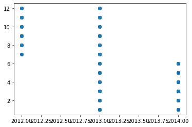
    


```python
df.drop(['month'], axis=1, inplace=True)
```


```python
#Объединю покупки онлайн и на месте

df['NumPurchases'] = df.NumStorePurchases + df.NumWebPurchases
```


```python
df
```


<div>
<style scoped>
    .dataframe tbody tr th:only-of-type {
        vertical-align: middle;
    }

    .dataframe tbody tr th {
        vertical-align: top;
    }

    .dataframe thead th {
        text-align: right;
    }
</style>
<table border="1" class="dataframe">
  <thead>
    <tr style="text-align: right;">
      <th></th>
      <th>Year_Birth</th>
      <th>Recency</th>
      <th>MntFruits</th>
      <th>MntMeatProducts</th>
      <th>MntFishProducts</th>
      <th>MntSweetProducts</th>
      <th>NumWebPurchases</th>
      <th>NumStorePurchases</th>
      <th>Response</th>
      <th>year</th>
      <th>NumPurchases</th>
    </tr>
  </thead>
  <tbody>
    <tr>
      <th>0</th>
      <td>1957</td>
      <td>58</td>
      <td>88</td>
      <td>546</td>
      <td>172</td>
      <td>88</td>
      <td>8</td>
      <td>4</td>
      <td>1</td>
      <td>2012</td>
      <td>12</td>
    </tr>
    <tr>
      <th>1</th>
      <td>1954</td>
      <td>38</td>
      <td>1</td>
      <td>6</td>
      <td>2</td>
      <td>1</td>
      <td>1</td>
      <td>2</td>
      <td>0</td>
      <td>2014</td>
      <td>3</td>
    </tr>
    <tr>
      <th>2</th>
      <td>1965</td>
      <td>26</td>
      <td>49</td>
      <td>127</td>
      <td>111</td>
      <td>21</td>
      <td>8</td>
      <td>10</td>
      <td>0</td>
      <td>2013</td>
      <td>18</td>
    </tr>
    <tr>
      <th>3</th>
      <td>1984</td>
      <td>26</td>
      <td>4</td>
      <td>20</td>
      <td>10</td>
      <td>3</td>
      <td>2</td>
      <td>4</td>
      <td>0</td>
      <td>2014</td>
      <td>6</td>
    </tr>
    <tr>
      <th>4</th>
      <td>1981</td>
      <td>94</td>
      <td>43</td>
      <td>118</td>
      <td>46</td>
      <td>27</td>
      <td>5</td>
      <td>6</td>
      <td>0</td>
      <td>2014</td>
      <td>11</td>
    </tr>
    <tr>
      <th>...</th>
      <td>...</td>
      <td>...</td>
      <td>...</td>
      <td>...</td>
      <td>...</td>
      <td>...</td>
      <td>...</td>
      <td>...</td>
      <td>...</td>
      <td>...</td>
      <td>...</td>
    </tr>
    <tr>
      <th>2235</th>
      <td>1967</td>
      <td>46</td>
      <td>43</td>
      <td>182</td>
      <td>42</td>
      <td>118</td>
      <td>9</td>
      <td>4</td>
      <td>0</td>
      <td>2013</td>
      <td>13</td>
    </tr>
    <tr>
      <th>2236</th>
      <td>1946</td>
      <td>56</td>
      <td>0</td>
      <td>30</td>
      <td>0</td>
      <td>0</td>
      <td>8</td>
      <td>5</td>
      <td>0</td>
      <td>2014</td>
      <td>13</td>
    </tr>
    <tr>
      <th>2237</th>
      <td>1981</td>
      <td>91</td>
      <td>48</td>
      <td>217</td>
      <td>32</td>
      <td>12</td>
      <td>2</td>
      <td>13</td>
      <td>0</td>
      <td>2014</td>
      <td>15</td>
    </tr>
    <tr>
      <th>2238</th>
      <td>1956</td>
      <td>8</td>
      <td>30</td>
      <td>214</td>
      <td>80</td>
      <td>30</td>
      <td>6</td>
      <td>10</td>
      <td>0</td>
      <td>2014</td>
      <td>16</td>
    </tr>
    <tr>
      <th>2239</th>
      <td>1954</td>
      <td>40</td>
      <td>3</td>
      <td>61</td>
      <td>2</td>
      <td>1</td>
      <td>3</td>
      <td>4</td>
      <td>1</td>
      <td>2012</td>
      <td>7</td>
    </tr>
  </tbody>
</table>
<p>2240 rows × 11 columns</p>
</div>


# Построение модели кластеризации


```python
from sklearn.metrics import silhouette_score
from sklearn.cluster import KMeans

n_clusters = list(range(2, 10))
metrics = []

for k in n_clusters:
    km=KMeans(n_clusters=k).fit(df)
    score=silhouette_score(df, km.labels_)
    metrics.append(score)
    
sns.lineplot(n_clusters, metrics);
```


    
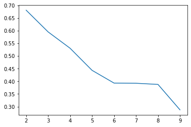
    

Как я понимаю, необходимость в точечности категорий категорий зависит от размеров бизнеса. 
Я бы не сказал что данные на 2000 человек это большой бизнес, поэтому в данном случае, хоть я и спрогнозировал 8 категорий, можно  ограничиться четыремя и не мучать маркетологов.
# Визуализация результатов


```python
from sklearn.manifold import TSNE

tsne = TSNE(n_components=2, perplexity=8)

df_emb = tsne.fit_transform(df)

data = pd.DataFrame(df_emb)
```


```python
km = KMeans(n_clusters=4).fit(df);

sns.scatterplot(data[0], data[1], hue=km.labels_);
```


    
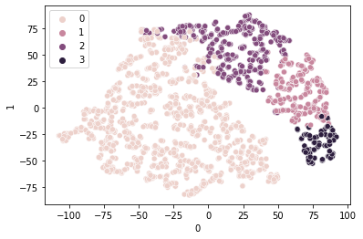
    


```python
#Выглядит вполне правдоподобно
```

# График кластеров


```python
import numpy as np


#Уже прогнав код и получив heatmap с бОльшим кол-вом фичей чем представлено ниже, я увидел что ценность имеют только эти 2
features = ['Response', 'NumPurchases']
group = km.labels_
functions = ['mean', 'std']

df_g = df.groupby(group).agg({x: functions for x in features}).T
df_g

stat = np.array([[df[feature].apply(f) for f in functions] for feature in features]).flatten()

df_g['global']=stat
    
df_g.round(2)
```


<div>
<style scoped>
    .dataframe tbody tr th:only-of-type {
        vertical-align: middle;
    }

    .dataframe tbody tr th {
        vertical-align: top;
    }

    .dataframe thead th {
        text-align: right;
    }
</style>
<table border="1" class="dataframe">
  <thead>
    <tr style="text-align: right;">
      <th></th>
      <th></th>
      <th>0</th>
      <th>1</th>
      <th>2</th>
      <th>3</th>
      <th>global</th>
    </tr>
  </thead>
  <tbody>
    <tr>
      <th rowspan="2" valign="top">Response</th>
      <th>mean</th>
      <td>0.10</td>
      <td>0.24</td>
      <td>0.16</td>
      <td>0.42</td>
      <td>0.15</td>
    </tr>
    <tr>
      <th>std</th>
      <td>0.30</td>
      <td>0.43</td>
      <td>0.37</td>
      <td>0.50</td>
      <td>0.36</td>
    </tr>
    <tr>
      <th rowspan="2" valign="top">NumPurchases</th>
      <th>mean</th>
      <td>7.16</td>
      <td>13.45</td>
      <td>14.84</td>
      <td>13.72</td>
      <td>9.83</td>
    </tr>
    <tr>
      <th>std</th>
      <td>4.10</td>
      <td>3.59</td>
      <td>3.63</td>
      <td>3.29</td>
      <td>5.20</td>
    </tr>
  </tbody>
</table>
</div>


# Визуализация кластеров, подытоживание 


```python
cluster_labels = [0, 1, 2, 3]

for label in cluster_labels:
    df_g[label] = 100* df_g[label]/df_g['global'] - 100

sns.heatmap(df_g[cluster_labels], cmap='coolwarm');
```


    
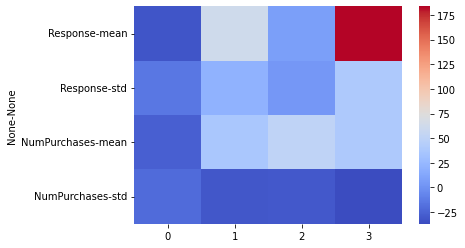
    


```python
sns.scatterplot(data[0], data[1], hue=km.labels_);
```


    

    


```python
#Категория "0" - Холодные клиенты с низким кол-вом покупок (те кто воспользовались разок). Их большинство. 
#Таких нужно плавно "прогревать".

#Категория "1" - Нейтральные клиенты со средним кол-вом покупок
#Работать с такими особенно выгодно, ведь их проще перевести в активных путем спецпредложений. Их где-то 10%.

#Категория "2" - Клиенты холодные к рекламе, но активно покупающие. 
#Раз они часто покупают, но до сих пор не отозвались на рекламу, значит их можно привлечь только очень выгодным предложением. 15% 

#Категория "3" - Лояльные клиенты. Это постоянный доход бизнеса. 
#Главное поддерживать с ними связь путем предложений для лояльных клиентов. 
#Например: скидок на следующую покупку, подарками за многократные покупки.
```
